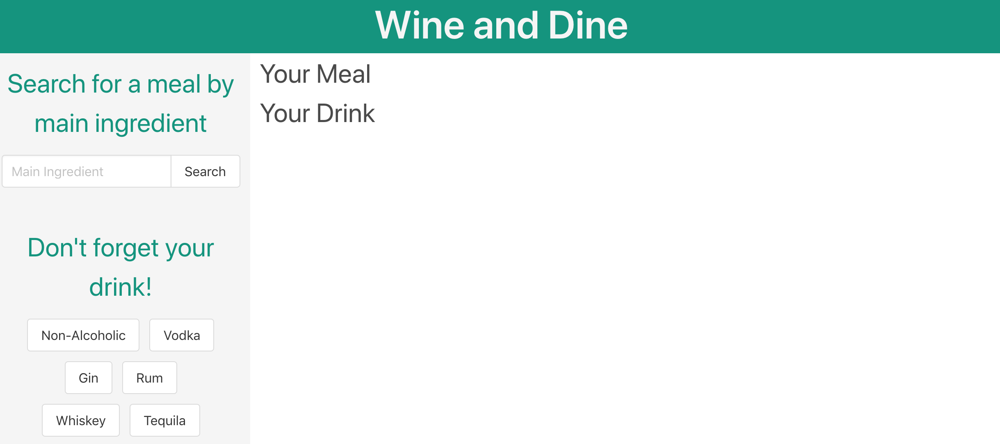

# Wine and Dine

## Purpose
A website that generates a meal option based on a main ingredient, as well as a drink based on the options of non-alcoholic or an alcohol base. 

## Built With
* HTML
* CSS (Bulma)
* JavaScript 

## Website
https://patrickmklee.github.io/Social-Media-Search/

## Screenshot

## Contribution
Made by Emily Kidd, Patrick Lee, and Cherrie Awang
